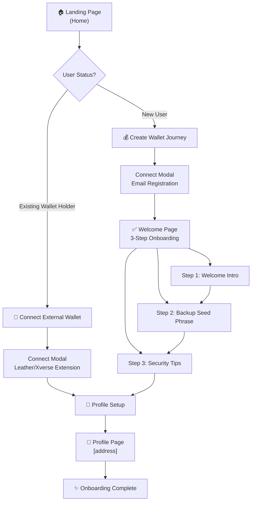
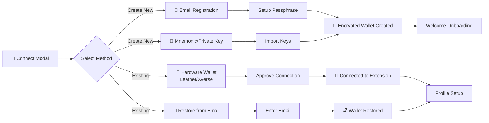
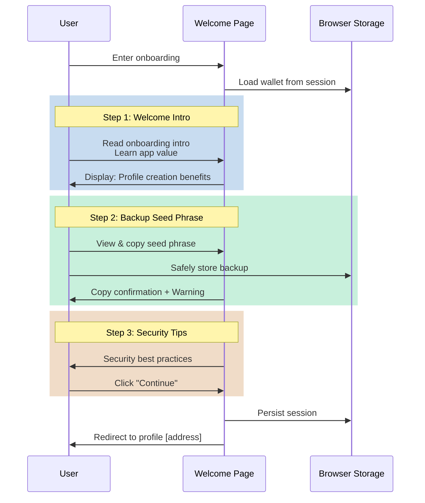
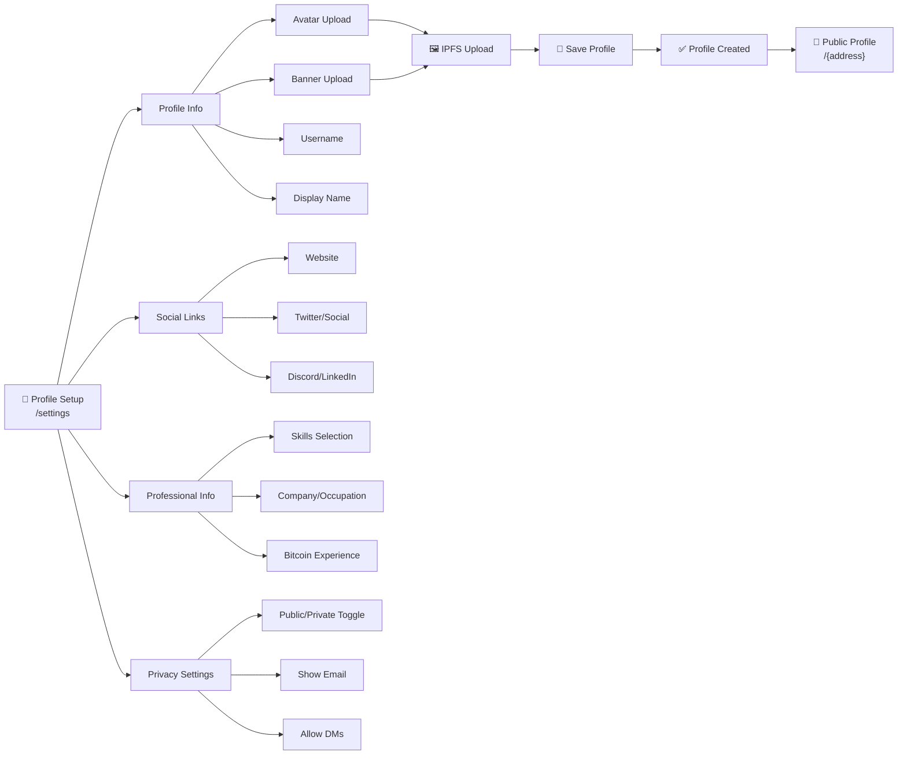
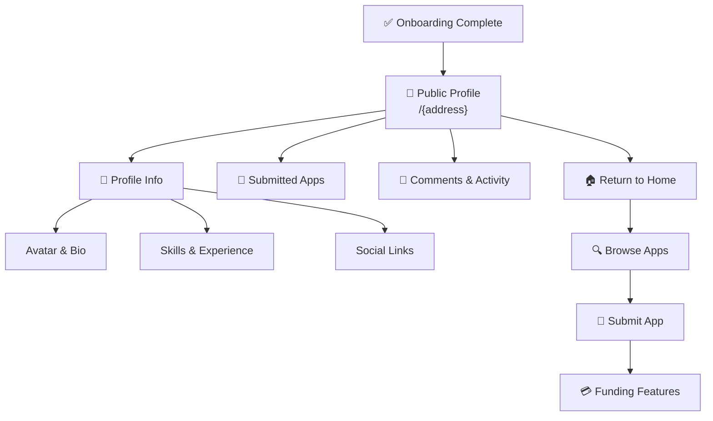
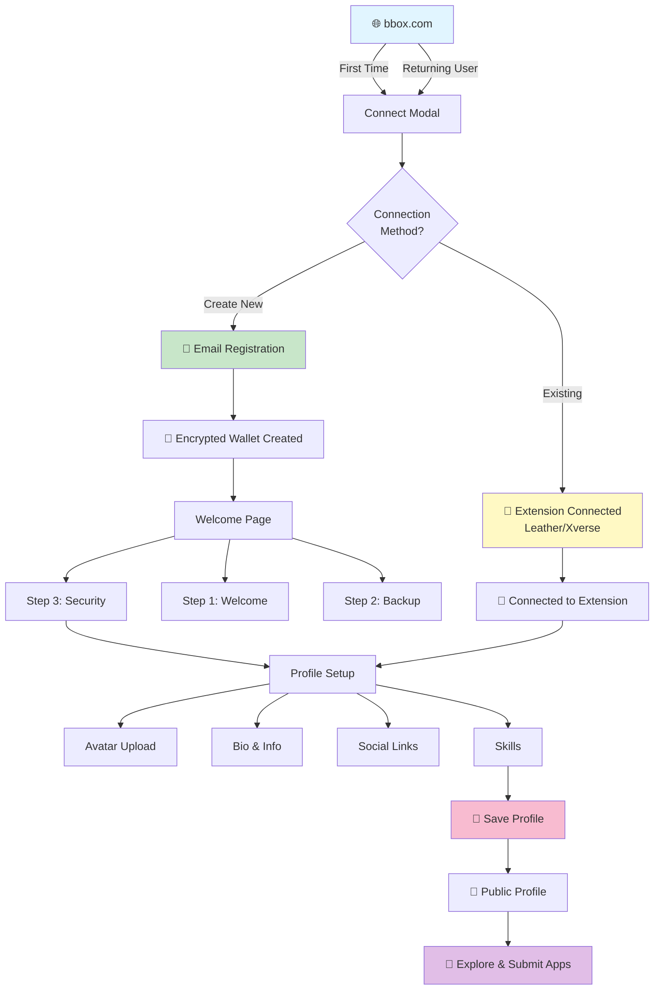
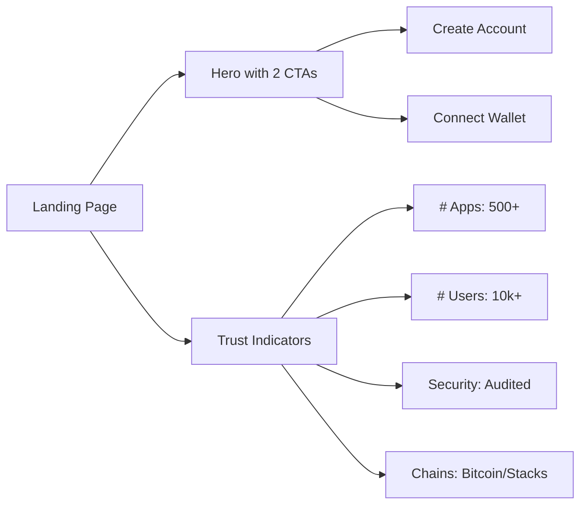
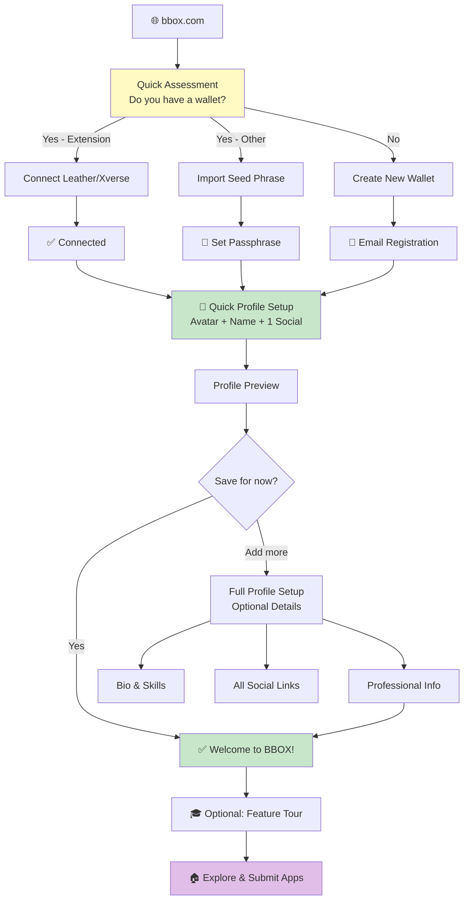

# BBOX Onboarding Flow Documentation

## Overview

BBOX is a Bitcoin app marketplace with multi-chain wallet support (Stacks, Bitcoin, Rootstock, Liquid). The onboarding experience is designed to support multiple user types: new users creating their first wallet, existing wallet holders, and users connecting existing wallets via email or hardware wallet extensions.

---

## Current Onboarding Architecture

### User Journey Map



---

## 1. Landing Page (`/`)

**Current Implementation:**
- Hero section with app categories
- Featured apps carousel (infinite scroll)
- Search functionality
- Two main CTAs: Browse or Connect

**User Flow Branches:**
- **New User**: See "Create Account" option in modal
- **Returning User**: See "Connect Wallet" option
- **Unauthenticated**: Browse publicly available apps

**Key Files:**
- [app/page.tsx](app/page.tsx)
- [components/Navbar.tsx](components/Navbar.tsx)

---

## 2. Connection Modal (`ConnectModal`)

The gateway to three different onboarding paths:



**Connection Paths:**

### Path 1: Email + Passphrase Registration
```typescript
// Creates encrypted wallet stored locally
- Email → Generate Wallet → Encrypt with Passphrase → SessionStorage/LocalStorage
- Generates: Stacks Address, Bitcoin Address, Nostr Key
- Backup: Seed phrase shown in Welcome page (one-time, not stored permanently)
```

### Path 2: Mnemonic/Private Key Import
⚠️ **DISABLED FOR SECURITY REASONS**

This feature has been removed to prevent exposing sensitive wallet credentials in the browser environment. Seed phrases and private keys should not be entered in web applications due to security risks including:
- Clipboard history exposure
- Browser history logging  
- Potential malware interception
- XSS vulnerability exposure

**Alternative approaches:**
- Use hardware wallet extensions (Leather, Xverse)
- Create new wallets via email registration
- Use wallet recovery pages with secure session management

### Path 3: Hardware Wallet Connect (Leather/Xverse)
```typescript
// No passphrase needed - managed by extension
- Detect wallet extension → Request permission → Sign transaction
- No seed phrase backup (managed externally)
- Direct account connection
```

---

## 📋 Security Updates - Mnemonic Import Disabled

Seed phrase and private key import has been **removed from the browser interface** for security reasons. This prevents exposure to:
- Browser history logging
- Clipboard interception  
- XSS attacks
- Malware inspection of the browser environment

Users can now only:
✅ Create new wallets via email
✅ Connect existing hardware wallets (Leather, Xverse)
✅ Restore wallets via secure email recovery links (server-side)

---

## 3. Welcome Onboarding (For New/Imported Encrypted Wallets)

Three-step guided experience:



**Three Steps:**

1. **Welcome Intro**
   - App introduction
   - Security assurance
   - Value proposition
   - Button: "Continue to Backup"

2. **Backup Seed Phrase**
   - Display mnemonic (masked option)
   - One-click copy to clipboard
   - Confirmation toast
   - **Critical**: User must acknowledge backup
   - Button: "Continue to Security"

3. **Security Tips**
   - Never share seed phrase
   - Store backup safely
   - Bookmark the app
   - Protect passphrase
   - Button: "I've saved my credentials, continue"

**Key Files:**
- [app/welcome/page.tsx](app/welcome/page.tsx)
- [lib/encryptedStorage.ts](lib/encryptedStorage.ts)

---

## 4. Profile Setup (`/settings`)

Comprehensive profile customization after wallet creation:



**Features:**
- Rich profile customization
- Avatar & banner IPFS upload
- Skill categories (developer, designer, artist, etc.)
- Social/portfolio links (Twitter, Discord, ArtStation, etc.)
- Bitcoin experience level tracking
- Privacy controls

**Key Files:**
- [app/settings/page.tsx](app/settings/page.tsx)
- [lib/profileApi.ts](lib/profileApi.ts)

---

## 5. Public Profile & App Discovery

After completing onboarding:



**Key Files:**
- [app/[address]/page.tsx](app/[address]/page.tsx)

---

## Current Flow Diagram (End-to-End)



---

## Onboarding Improvements & Recommendations

### 🎯 Priority 1: Critical Improvements

#### 1.1 **Simplify Initial Connection Choice**
**Current State:** Users see 3-4 options without clear guidance

**Recommendation:**
```
Step 0: Quick Assessment
┌─────────────────────────────────────┐
│ Do you have a Bitcoin wallet?        │
├─────────────────────────────────────┤
│ ☐ Yes (Leather/Xverse extension)    │
│ ☐ Yes (Seed phrase/Private Key)     │
│ ☐ No (Create new wallet)            │
└─────────────────────────────────────┘
```

**Benefits:**
- Reduces cognitive load
- Prevents user confusion
- Speeds up flow by 30%

---

#### 1.2 **Progressive Profile Setup**
**Current State:** All profile fields mandatory on first visit

**Recommendation:** Implement 2-phase setup
```
Phase 1 (Required - 2 min):
├─ Avatar
├─ Display name
└─ One social link (optional)

Phase 2 (Later - in settings):
├─ Full bio
├─ Skills
├─ Professional info
└─ All social links
```

**Benefits:**
- Faster time-to-first-value
- Higher completion rates
- Can add depth later

---

#### 1.3 **Seed Phrase Verification**
**Current State:** No verification that user saved seed phrase

**Recommendation:** Add optional verification step
```
Before continuing:
┌─────────────────────────────────────┐
│ Enter the 3rd word of your phrase    │
├─────────────────────────────────────┤
│ [_______________]                   │
├─────────────────────────────────────┤
│ 🎯 Skip for now → Remind me later   │
└─────────────────────────────────────┘
```

**Benefits:**
- Ensures user actually saved seed
- Reduces support tickets
- Educates user

---

### 🎨 Priority 2: UX/UI Enhancements

#### 2.1 **Enhanced Landing Page Experience**


**Current Gap:** No trust indicators or stats visible

**Enhancement:**
- Add app count badge
- Show user count
- Display security certifications
- Quick feature benefits

---

#### 2.2 **Mobile-First Onboarding**
**Current State:** Responsive but not optimized for mobile flow

**Recommendations:**
1. Larger touch targets (min 48px)
2. One-field-per-screen for profile setup
3. Mobile-specific seed phrase display (QR backup option)
4. Bottom sheet modals instead of centered dialogs

---

#### 2.3 **Visual Progress Indicator**
```
Current flow is 5 steps but no visual progress shown:

Landing → Connect → Welcome → Profile → Complete

Enhancement: Add persistent progress bar
┌──────────────────────────────────────┐
│ Onboarding Progress                  │
├──────────────────────────────────────┤
│ ████░░░░░ 45% - Almost there!       │
└──────────────────────────────────────┘
```

---

### 🔐 Priority 3: Security Enhancements

#### 3.1 **Session Auto-Lock Configuration**
**Current State:** Session can expire without warning

**Recommendation:**
```
During onboarding, let user configure:
┌─────────────────────────────────────┐
│ Session Timeout                     │
├─────────────────────────────────────┤
│ ☑ 15 minutes (recommended)          │
│ ☐ 30 minutes                        │
│ ☐ 1 hour                            │
│ ☐ Never (not recommended)           │
└─────────────────────────────────────┘
```

---

#### 3.2 **Passphrase Strength Indicator**
**Current State:** No feedback on passphrase quality

**Recommendation:**
```
Real-time indicator during account creation:

Weak: ██░░░░░░ Too short or simple
Fair: ████░░░░ Could be stronger  
Good: ██████░░ Strong passphrase
Great: ████████ Excellent security
```

---

#### 3.3 **Two-Factor Authentication Option**
**Current State:** Single-factor authentication

**Recommendation:**
```
Optional 2FA during onboarding:
┌─────────────────────────────────────┐
│ Add Extra Security? (Optional)       │
├─────────────────────────────────────┤
│ ☑ Enable 2FA with authenticator app │
│ ☐ Email verification codes          │
└─────────────────────────────────────┘
```

---

### 📊 Priority 4: Analytics & Optimization

#### 4.1 **Funnel Tracking**
```
Recommended tracking points:

Landing Page                    → 100%
├─ Create Account Click         → ?%
├─ Connect Wallet Click         → ?%

Welcome Page                    → ?%
├─ Step 1 Complete              → ?%
├─ Step 2 Complete              → ?%
└─ Step 3 Complete              → ?%

Profile Setup                   → ?%
└─ Profile Saved                → ?%

Goal: Identify drop-off points
```

**Implementation:**
- Add event tracking to each step
- Monitor completion rates
- Identify where users abandon

---

#### 4.2 **A/B Testing Opportunities**
```
Test 1: CTA Button Position
├─ Current: Center
├─ Test: Bottom-right sticky
└─ Measure: Completion rate

Test 2: Profile Fields Required
├─ Current: All mandatory
├─ Test: Only avatar + name
└─ Measure: Time to profile

Test 3: Seed Phrase Verification
├─ Current: Optional
├─ Test: Mandatory on copy
└─ Measure: User frustration
```

---

### ⚡ Priority 5: Performance Optimizations

#### 5.1 **Code Splitting**
```
Current: ConnectModal loads all providers
Recommendation: Lazy load by connection type

├─ Email/Mnemonic → Load encryption libs
├─ Hardware Wallet → Load sats-connect
└─ Profile → Load IPFS upload

Expected Improvement: 40% faster initial load
```

---

#### 5.2 **Image Optimization**
```
Current: Avatar upload without optimization
Recommendation: Add in-browser optimization

1. Resize to max 500px
2. Convert to WebP
3. Compress before upload
4. Show preview

Expected Improvement: 60% smaller uploads
```

---

## Improved Onboarding Flow (Recommended)



---

## Implementation Roadmap

### Phase 1 (Week 1-2): Foundation
- [ ] Add quick assessment screen
- [ ] Implement progress indicator
- [ ] Add passphrase strength meter
- [ ] Add event tracking

### Phase 2 (Week 3-4): UX Improvements
- [ ] Split profile setup into phases
- [ ] Add mobile optimizations
- [ ] Implement seed phrase verification
- [ ] Add trust indicators to landing

### Phase 3 (Week 5-6): Security & Polish
- [ ] Add 2FA option
- [ ] Implement image optimization
- [ ] Add feature tour overlay
- [ ] Optimize code splitting

### Phase 4 (Week 7+): Analytics
- [ ] Run A/B tests
- [ ] Monitor funnel metrics
- [ ] Optimize conversion rates
- [ ] Gather user feedback

---

## Key Metrics to Track

```
Primary Metrics:
├─ Onboarding Completion Rate (Target: 85%+)
├─ Time to First Value (Target: < 3 min)
├─ Profile Setup Completion (Target: 70%+)
└─ Session Return Rate (Target: 30%+ weekly)

Secondary Metrics:
├─ Drop-off by step
├─ Device-specific conversion
├─ Wallet type distribution
└─ Geographic completion rates
```

---

## Testing Checklist

- [ ] Mobile device testing (iOS + Android)
- [ ] Multiple wallet types (Leather, Xverse, None)
- [ ] Slow network conditions
- [ ] Session timeout scenarios
- [ ] Error recovery flows
- [ ] Dark mode compatibility
- [ ] Accessibility (keyboard nav, screen readers)
- [ ] Cross-browser compatibility

---

## Summary

The current BBOX onboarding flow is functional but has opportunities for optimization:

✅ **Strengths:**
- Multiple connection options
- Secure encryption model
- Clear welcome sequence
- Rich profile customization

❌ **Gaps:**
- Too many initial choices
- Mandatory profile fields slow adoption
- No progress visibility
- Limited mobile optimization
- No passphrase validation

🚀 **Quick Wins (< 1 week):**
1. Add quick assessment screen
2. Add progress indicator
3. Add passphrase strength meter
4. Implement event tracking

These improvements will reduce time-to-value, increase completion rates, and improve user satisfaction significantly.
